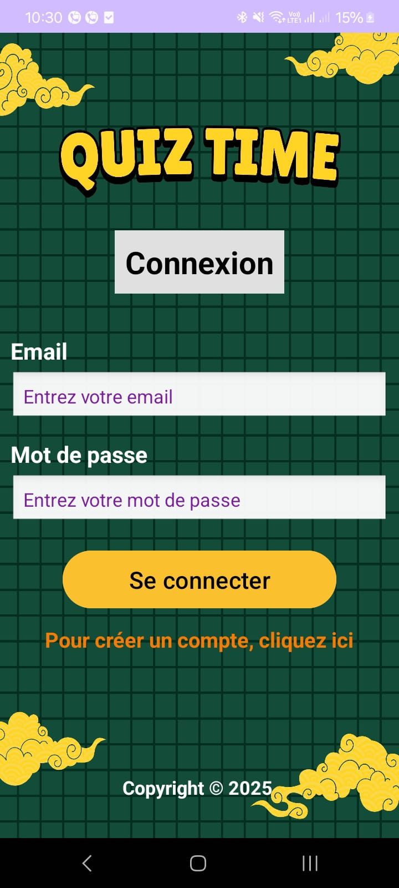
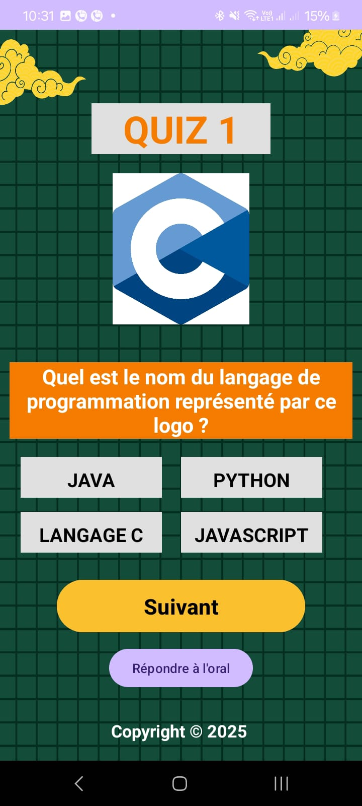
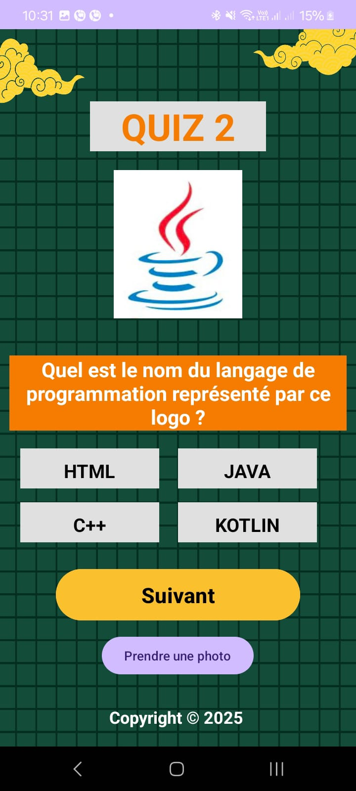
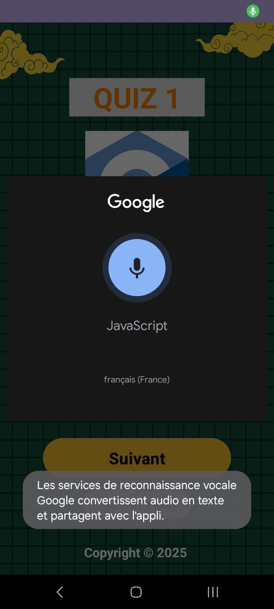
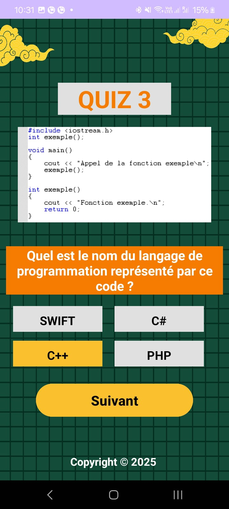
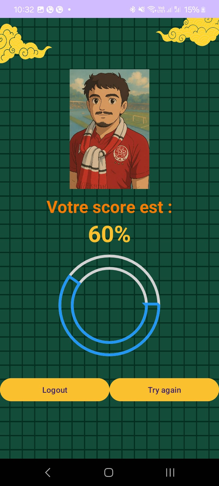

# 📱 QuizApp_DebugUrMind

**QuizApp_DebugUrMind** est une application mobile Android éducative et interactive développée avec **Java** et **XML** sous **Android Studio**, destinée à tester les connaissances des utilisateurs en **programmation informatique** à travers des quiz visuels et fonctionnels.

---

## 🧠 Description

Cette application propose une expérience d'apprentissage gamifiée à travers :

- Des quiz sur les **langages de programmation** identifiables par leurs **icônes**.
- Un système de **score**, de **progression** et de **feedback**.
- Une **authentification sécurisée** via Firebase.
- L’intégration de **Supabase** pour la gestion des données (stockage des scores, utilisateurs, etc.).
- Des fonctionnalités avancées comme la **reconnaissance vocale**, la **géolocalisation** et la **prise de photos**.

---

## ✨ Fonctionnalités principales

- 🔐 **Page d'authentification et d'inscription** (Firebase Auth)
- 🎓 **5 pages de quiz** sur les langages de programmation (questions illustrées avec des icônes)
- 📊 **Page de score** récapitulant les bonnes réponses et progression
- 🗺️ **Localisation en temps réel** de l'utilisateur via **Google Maps API**
- 🎤 **Réponse vocale** grâce à la **reconnaissance vocale (Speech-to-Text)** intégrée
- 📸 **Prise de photo** via l'appareil photo natif
- 🧠 UX intuitive et adaptée à l’apprentissage rapide

---

## 🧰 Technologies utilisées

| Composant             | Technologie             |
|-----------------------|--------------------------|
| Front-end             | XML (Android Layout)     |
| Back-end              | Java (Android Studio)    |
| Authentification      | Firebase Auth            |
| Base de données       | Supabase (via API REST)  |
| Localisation          | Google Maps API          |
| Reconnaissance vocale | Android SpeechRecognizer |
| Appareil photo        | Android Camera API       |

---

## 📸 Aperçus de l'application

| Page | Aperçu |
|------|--------|
| 🧑‍💻 Authentification / Inscription | |
| 🎮 Quiz avec icônes | |
| 🗺️ Localisation via Google Maps | |
| 🎤 Réponse vocale ||
| 📸 Prise de photo ||
| 📊 Page de score ||

---


## 🔧 Installation

### Pré-requis

- Android Studio installé
- Clé d’API Google Maps configurée
- Fichier `google-services.json` intégré dans le dossier `/app`
- Accès aux services Firebase et Supabase

### Étapes

1. Clonez le projet :

```bash
git clone https://github.com/ton-utilisateur/QuizApp_DebugUrMind.git
